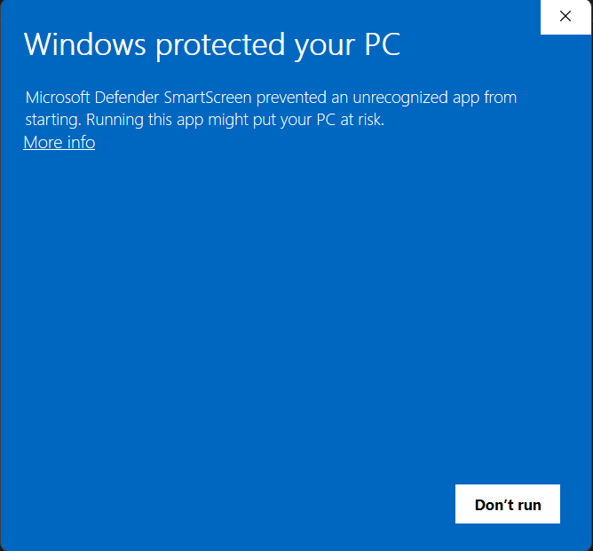

# Secure Password Generator 🔑🔒

A simple windows application that allows you to create strong and secure passwords.

## How it works?

It's very simple. **Here are the instructions:**

1. Choose your desired length for your password by using the slider
2. Choose what you want to include in your password by clicking the checkboxes provided.
3. Click the "Generate" button when finished
4. Copy the generated password by clicking the "copy" button above the "Choose your desired password length" area.

## Download

To download this application on Github, click on "Zam Secure Pass V1" under "Releases", then click on "Zam.Secure.Pass.exe".

On my Portfolio website, click "Download project" for the application under the Projects section.

When you open the app, ignore the pop-up from Microsoft Defender, saying **"it prevented an unrecognized app from starting"**, the app is **virus free**, this only shows because I haven't yet purchased a code signing certificate for it from Microsoft. Microsoft automatically red flags apps that do not have their certificate.

### Ignore this, select more info, then select the "Run anyway" button when it appears at the bottom.

And there you go!

## Feedback

To give feedback, please visit my Portfolio website and contact me from there.

###

© 2026. All rights reserved. Zamar Wint, software engineer.
