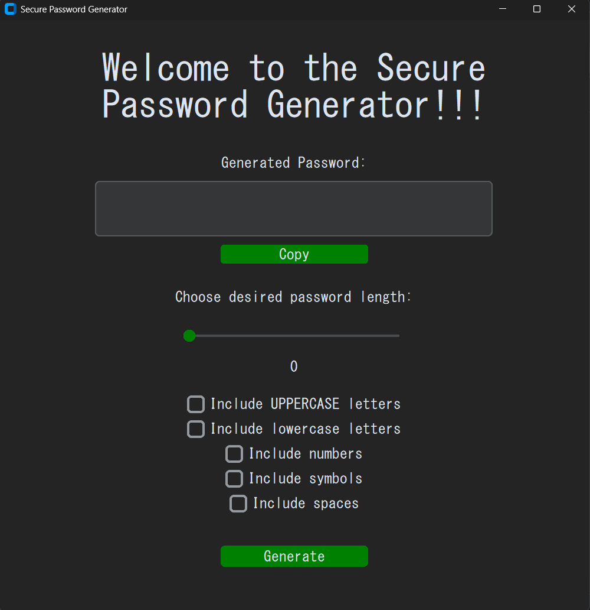

# Secure Password Generator 🔑🔒

A simple windows application that allows you to create strong and secure passwords.

## How it works?

It's very simple. **Here are the instructions:**

1. Choose your desired length for your password by using the slider
2. Choose what you want to include in your password by clicking the checkboxes provided.
3. Click the "Generate" button when finished
4. Copy the generated password by clicking the "copy" button above the "Choose your desired password length" area.

## Download

To download this application on Github, click on "Zam Secure Pass V1" under "Releases", then click on "Zam.Secure.Pass.exe".

On my Portfolio website, click "Download project" for the application under the Projects section.

## Feedback

To give feedback, please visit my Portfolio website and contact me from there.

###

© 2026. All rights reserved. Zamar Wint, software engineer.
